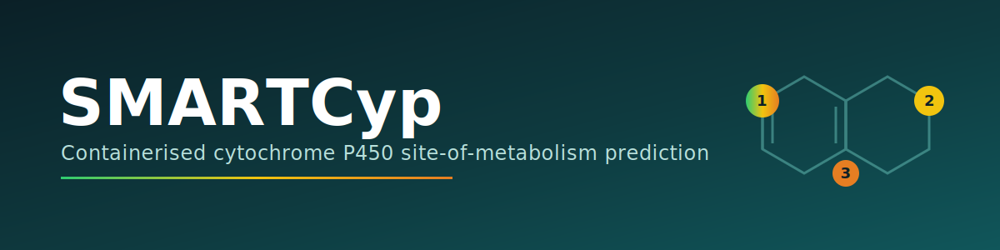
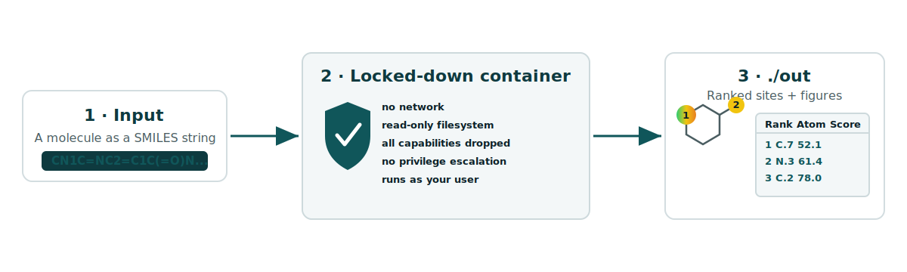

<p align="center">
  
</p>

<p align="center">
  
  
  
  
</p>

> A self-contained Docker image for **SMARTCyp** — an *in silico* method that predicts the most likely **sites of cytochrome P450 (CYP) mediated metabolism** of drug-like molecules, directly from a 2D structure (a SMILES string). No 3D structures, no electronic-property calculations, no internet access required.

SMARTCyp is a reactivity model derived from density functional theory (DFT) activation energies. It ranks the atoms of a molecule by how readily they are expected to be metabolised, which is useful in early drug design for anticipating metabolic hotspots and ADME/toxicity liabilities. This repository ships SMARTCyp as a single, locked-down container image so you can run it reproducibly and entirely offline.

---

## Workflow

<p align="center">
  
</p>

You hand the container a SMILES string. It runs SMARTCyp inside a sandbox with no network and a read-only filesystem, and writes the ranked results into a folder on your machine.

---

## What's in this repository

| File | Description |
|------|-------------|
| `smartcyp.tar.gz` | The full SMARTCyp application packaged as a Docker image. This is everything you need. |

There is nothing to compile and no dependencies to install beyond Docker itself.

---

## Requirements

- **Docker** (Docker Desktop on macOS/Windows, or Docker Engine on Linux). On Windows, run the commands inside **WSL2** or Git Bash.
- Roughly a few hundred MB of free disk space for the loaded image.

Check Docker is available:

```bash
docker --version
```

---

## Installation

Load the prebuilt image from the tarball:

```bash
docker load -i smartcyp.tar.gz
```

Confirm the image is now available locally:

```bash
docker images smartcyp
```

---

## Usage

Create an output directory, then run the container, replacing the example SMILES with your own molecule:

```bash
mkdir -p out
docker run --rm --network none \
    --read-only --tmpfs /tmp \
    --cap-drop ALL \
    --security-opt no-new-privileges \
    -v "$PWD/out:/data" \
    --user "$(id -u):$(id -g)" \
    smartcyp -smiles "[input-smiles-here]"
```

Results are written to the `out/` directory that you mounted. Because the container runs as your own user, those files are owned by you (not by `root`).

> **Tip:** wrap the SMILES in quotes — many SMILES contain characters such as `(`, `)`, `=` and `#` that your shell would otherwise interpret.

### Example

Predict sites of metabolism for **caffeine**:

```bash
mkdir -p out
docker run --rm --network none \
    --read-only --tmpfs /tmp \
    --cap-drop ALL \
    --security-opt no-new-privileges \
    -v "$PWD/out:/data" \
    --user "$(id -u):$(id -g)" \
    smartcyp -smiles "CN1C=NC2=C1C(=O)N(C(=O)N2C)C"
```

A few more molecules to try:

| Molecule | SMILES |
|----------|--------|
| Ibuprofen | `CC(C)Cc1ccc(cc1)C(C)C(=O)O` |
| Diclofenac | `OC(=O)Cc1ccccc1Nc1c(Cl)cccc1Cl` |
| Warfarin | `CC(=O)CC(c1ccccc1)c1c(O)c2ccccc2oc1=O` |

---

## Understanding the run command

The flags keep the container fast, reproducible and tightly sandboxed. Each one is doing a specific job:

| Flag | Why it's there |
|------|----------------|
| `--rm` | Deletes the container as soon as it finishes, so nothing is left lying around. |
| `--network none` | No network access at all. SMARTCyp is fully offline, and this guarantees nothing leaves your machine. |
| `--read-only` | Mounts the container's own filesystem as read-only. |
| `--tmpfs /tmp` | Provides a small, writable, in-memory scratch space at `/tmp` (needed because the rest of the filesystem is read-only). |
| `--cap-drop ALL` | Drops every Linux capability — the process gets no special kernel privileges. |
| `--security-opt no-new-privileges` | Prevents the process from ever escalating its privileges. |
| `-v "$PWD/out:/data"` | Mounts your local `out/` folder to `/data` inside the container — this is how results get back to you. |
| `--user "$(id -u):$(id -g)"` | Runs as your user/group so output files are owned by you, not `root`. |

---

## Input and output

**Input** — a single molecule expressed as a SMILES string, passed via `-smiles`.

**Output** — written into the mounted `out/` directory. SMARTCyp produces a ranking of the molecule's atoms ordered by predicted likelihood of CYP-mediated metabolism, together with a 2D depiction of the molecule highlighting the top-ranked sites. The lower the energy/score for an atom, the more reactive (more likely to be metabolised) that position is predicted to be.

> Exact file names and formats depend on this image's build of SMARTCyp; check the `out/` folder after a run to see what was generated.

---

## Troubleshooting

- **`docker: command not found`** — Docker isn't installed or isn't on your `PATH`. Install Docker and reopen your terminal.
- **`permission denied` talking to the Docker daemon (Linux)** — add your user to the `docker` group (`sudo usermod -aG docker $USER`) and start a new session, or prefix commands with `sudo`.
- **`$(id -u)` / `$PWD` printed literally** — you're not in a POSIX shell. On Windows use WSL2 or Git Bash rather than PowerShell/CMD, or substitute absolute paths manually.
- **No files in `out/`** — make sure you created the directory first (`mkdir -p out`) and that the SMILES string is valid and quoted.
- **Invalid/unsupported SMILES** — double-check the structure; some exotic atoms or malformed strings won't parse.

---

## Citing SMARTCyp

SMARTCyp is developed by the research group at the University of Copenhagen. If you use it in published work, please cite the original papers:

- Rydberg, P., Gloriam, D. E., Zaretzki, J., Breneman, C., Olsen, L. *SMARTCyp: A 2D Method for Prediction of Cytochrome P450-Mediated Drug Metabolism.* **ACS Med. Chem. Lett.** 2010, 1 (3), 96–100.
- Rydberg, P., Gloriam, D. E., Olsen, L. *The SMARTCyp cytochrome P450 metabolism prediction server.* **Bioinformatics** 2010, 26 (23), 2988–2989.
- Olsen, L., Montefiori, M., Tran, K. P., Jørgensen, F. S. *SMARTCyp 3.0: enhanced cytochrome P450 site-of-metabolism prediction server.* **Bioinformatics** 2019, 35 (17), 3174–3175.

The official web server is available at <https://smartcyp.sund.ku.dk>.

---

## License & credits

SMARTCyp itself is the work of its original authors and is distributed under their own terms — refer to the upstream project for licensing of the SMARTCyp method and source code. This repository only provides a containerised distribution for convenient, offline, reproducible use.
